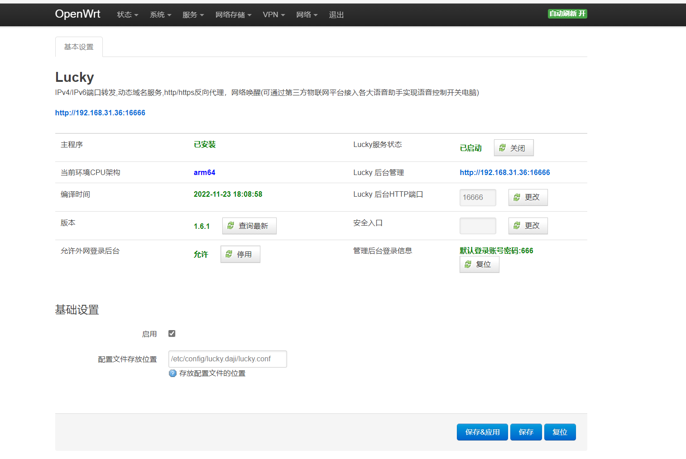
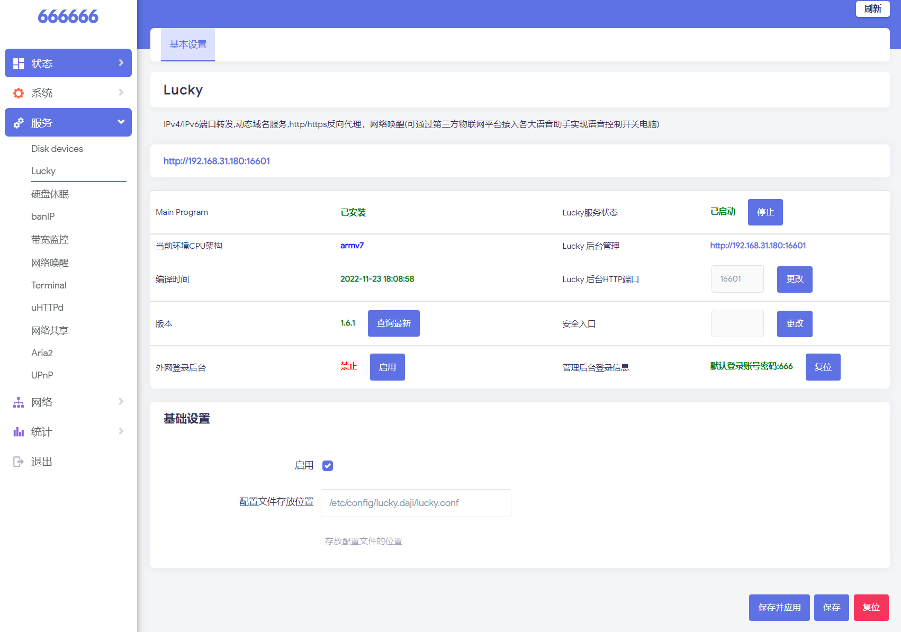

## 怎么确定当前系统CPU架构下载相应lucky核心包
复制以下指令到终端执行,根据显示下载文件名含有架构字符串的ipk包
```
cd /tmp ;if [ -f /usr/bin/curl ];then curl -sSO http://release.66666.host/luckyarch.sh;else wget -O http://release.66666.host/luckyarch.sh;fi;sh luckyarch.sh 
```


## 1.X升级2.X版本注意

第一种方法：先通过lucky后台上传tar.gz方式升级lucky
再安装

- luci-app-lucky 
- luci-i18n-lucky-zh-cn 

两个ipk包

第二种方法：

lucky后台备份配置下载保存后，将lucky相关IPK卸载干净
```
opkg remove lucky
opkg remove luci-i18n-lucky-zh-cn
opkg remove luci-app-lucky
```

再安装 
- lucky 
- luci-app-lucky 
- luci-i18n-lucky-zh-cn 

三个ipk包


本分支本人自用,仅供参考.
配置文件架构和https://github.com/sirpdboy/luci-app-lucky 版本可能存在冲突,

替换版本前请使用前备份下载lucky配置

然后执行执行
```
opkg remove lucky
opkg remove luci-i18n-lucky-zh-cn
opkg remove luci-app-lucky
```
卸载删除干净之前文件.


最新版本编译好的IPK包请在
https://url21.ctfile.com/d/44547821-55537427-a5525e?p=16601
下载


## 使用方法
   
- 将luci-app-lucky添加至 LEDE/OpenWRT 源码的方法。


### 下载源码：

 ```Brach 
 
    进入lede/openwrt项目根目录下
    # 下载源码
	
    git clone  https://github.com/gdy666/luci-app-lucky.git package/lucky
	
 ``` 
### 配置菜单

 ```Brach
    make menuconfig
	# 找到 LuCI -> Applications, 选择 luci-app-lucky, 保存后退出。
 ``` 
 
### 编译

 ```Brach 
    # 编译lucky IPK包
    make package/lucky/lucky/compile V=s
    # 编译luci-app-lucky IPK包
    make package/lucky/luci-app-lucky/compile V=s
    
 ```


## 截图

