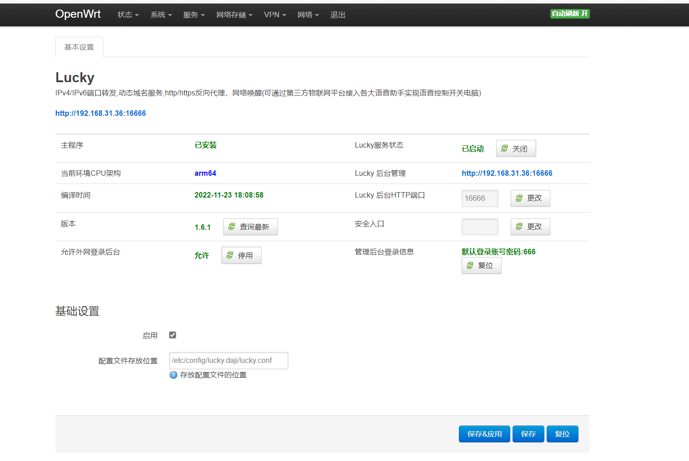
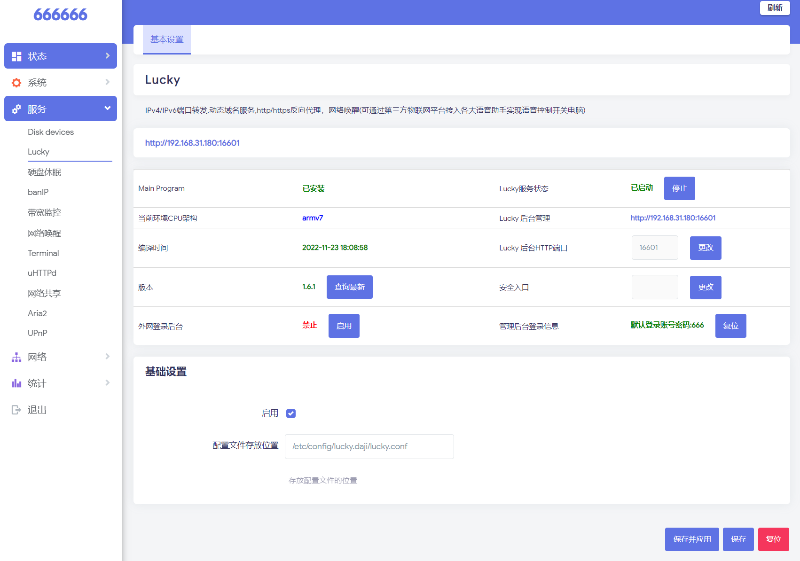

# luci-app-lucky

OpenWrt 的 Lucky 核心包与 LuCI 管理界面，支持服务管理、打开 Lucky 后台及手动刷新状态。

- `lucky`：Lucky 核心。
- `luci-app-lucky`：LuCI 管理界面。
- `luci-i18n-lucky-zh-cn`：简体中文语言包。

## 兼容性

支持 OpenWrt 19.07、21.02、22.03、23.05、24.10（IPK）及 25.12 / Snapshot（APK）。请选择与设备的 OpenWrt 版本和包架构匹配的软件包。

## 安装与升级

将对应的软件包上传到路由器 `/tmp`，在路由器终端执行。

**IPK：**

```sh
opkg install /tmp/lucky_*.ipk
opkg install /tmp/luci-app-lucky_*.ipk /tmp/luci-i18n-lucky-zh-cn_*.ipk
```

**APK：**

```sh
apk add --allow-untrusted /tmp/lucky-*.apk
apk add --allow-untrusted /tmp/luci-app-lucky-*.apk /tmp/luci-i18n-lucky-zh-cn-*.apk
```

安装后进入 LuCI 的 **服务 → Lucky**。

旧版可直接安装新版软件包升级，无需先卸载。升级会保留服务配置和 Lucky 数据，建议提前在 Lucky 后台导出备份。

## 构建与开发

参见 [构建说明](BUILDING.md) 和 [贡献说明](CONTRIBUTING.md)。

## 界面预览

以下为旧版截图，v3 界面随 LuCI 主题自适应。





## License

- Lucky 核心：MIT
- LuCI 管理界面：Apache-2.0
